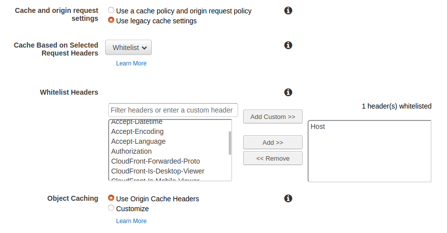

I got several requests to debug cloudfront issue while configured in front of websocket. So I created this project to fix the issues myself and make websocket work behind cloudfront. This project code is copied from  [here](https://codeburst.io/building-your-first-chat-application-using-flask-in-7-minutes-f98de4adfa5d) and slightly modified.

# How to install
- I have used Ubuntu 20.04 server to run it.

- Install pre-requisites. 
```shell script
sudo apt update
sudo apt-get install software-properties-common
sudo add-apt-repository ppa:deadsnakes/ppa
sudo apt update
sudo apt install python3.6
sudo apt install python3-pip
sudo apt install python-is-python3
pip3 install -r requirements.txt
```
- Install supervisor and run the websocket.
```shell script
sudo apt install supervisor
sudo su 
cat > /etc/supervisor/conf.d/socketio.conf << 'EOF'
[program:socketio]
command=python app.py
numprocs=1
directory=/home/ubuntu/cloudfront-flask-socketio
autostart=true
autorestart=unexpected
user=ubuntu
stdout_logfile=/var/log/socketio.log
stderr_logfile=/var/log/socketio_error.log
EOF
supervisorctl update
```
- Server is running in port 5000. Lets run it in default http 80 port. [Here](https://flask-socketio.readthedocs.io/en/latest/#using-nginx-as-a-websocket-reverse-proxy) 's good tutorial if you want to learn more about how to run socketio behind nginx reverse proxy.

```shell script
sudo apt install nginx
sudo unlink /etc/nginx/sites-enabled/default
sudo su 
cat > /etc/nginx/sites-available/socketio << 'EOF'
server {
    listen 80;
    server_name _;

    location / {
        include proxy_params;
        proxy_pass http://127.0.0.1:5000;
    }

    location /socket.io {
        include proxy_params;
        proxy_http_version 1.1;
        proxy_buffering off;
        proxy_set_header Upgrade $http_upgrade;
        proxy_set_header Connection "Upgrade";
        proxy_pass http://127.0.0.1:5000/socket.io;
    }
}
EOF
ln -s /etc/nginx/sites-available/socketio /etc/nginx/sites-enabled/
nginx -t # Check if the configuration is correct
service nginx reload
```

- How to configure cloudfront. When you configure **Cloudfront Cache Behavior**, 2 settngs are very important.

1. Configure cache such a way that it forwards **`Host`** Header. To make sure it forwards *`Host`* Header, I used `Use legacy cache settings` under `Cache and origin request settings` and whitelisted *`Host`* Header.



2. Make sure `Query String Forwarding and Caching` forwards all query and caches based on all query string.


